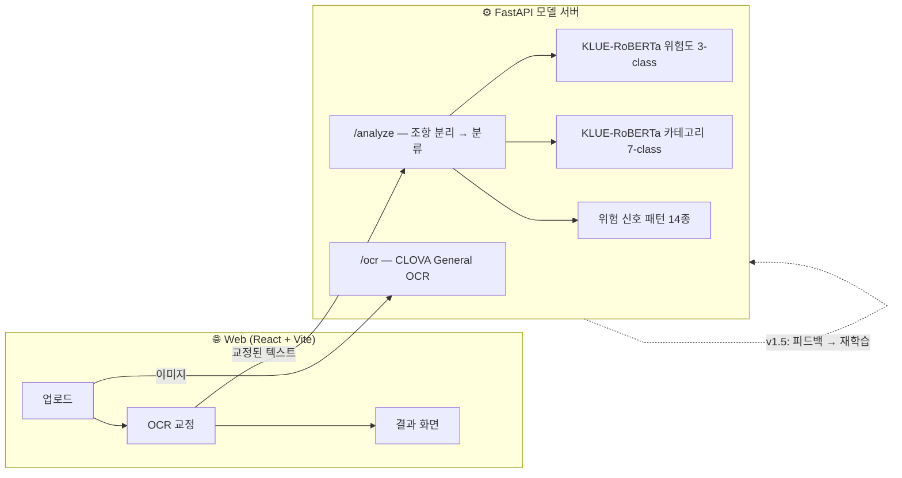

# 🛡️ 계약서 지킴이 (Contract Guardian)

> **서명하기 전 5분, 전월세 계약서의 특약을 확인하세요.**
> 사회초년생을 위한 전월세 계약서 특약 조항 AI 분석 웹 서비스


---

## 왜 만들었나

부동산 사무실에서 계약서를 처음 받아보는 순간은 대부분 **계약 당일, 서명 직전**이다.

- 특약사항 6~7줄을 읽고 판단할 시간은 몇 분뿐이다.
- 옆에서 중개사는 "다 표준 문구예요"라고 말한다.
- "원상복구", "근저당", "제소전화해" 같은 용어의 의미와 위험성을 모른다.

기존 서비스(내집스캔·집체크)는 계약 **전** 매물과 임대인을 검증하고, B2B 계약 검토(로폼 등)는
기업 법무팀용이다. **계약 당일 눈앞의 계약서 문서 자체**를 조항 단위로 분석해주는 도구는 없었다.

## 무엇을 하나

```
계약서 촬영 → OCR → 사용자 교정 → 조항 자동 분리
→ 조항별 위험도(3단계)·카테고리(7종) 분류   ← 직접 구축한 데이터로 파인튜닝한 모델
→ 판정 근거 신호 표시 → 요약 리포트
```

| 화면 | 내용 |
|---|---|
| 업로드 | 사진 촬영/선택 또는 텍스트 붙여넣기 (OCR 실패 대비 이중 경로) |
| 교정 | OCR 결과를 사용자가 직접 확인·수정 — **교정 없이는 분석하지 않음** |
| 결과 | 요약 카드, 위험도순 조항 카드(카테고리·확신도·감지 신호), 법률 자문 아님 고지 |

## 핵심 설계 원칙

1. **판별은 학습 모델, 설명은 LLM.** 위험 판별은 일관성·재현성·정량 평가가 가능한
   파인튜닝 분류 모델이 담당한다. LLM이 즉석에서 위험 여부를 판단하지 않는다.
2. **False Negative 최소화.** 위험 조항을 정상이라고 말하는 것이 최악의 오류다.
   평가 1순위 지표는 `danger` 클래스 Recall이고, 확신이 낮으면 `확인 필요`로 표시한다
   (confidence threshold 0.7 — 모르는 것을 아는 척하지 않는다).
3. **이중 안전망.** 모델 판정과 독립적으로, 라벨링 가이드라인에서 추출한 위험 신호
   패턴 14종을 함께 표시한다. 실제 테스트에서 모델이 하향 판정한 위험 조항을
   패턴 신호가 잡아낸 사례가 있다.

## 데이터셋을 직접 만들었다 — 이 프로젝트의 중심 스토리

공개된 "임대차 특약 위험도 라벨 데이터셋"은 존재하지 않는다. 그래서 구축부터 시작했다.

```
위험 패턴 유형표 (7 카테고리 × 3 위험도 = 21칸, 칸별 최소 수량 강제)
→ 출처별 수집: 법무부 표준계약서 · 전세사기 예방 가이드 · 커뮤니티 · 직접 작성   [시드 229문장]
→ 라벨링 가이드라인 v0.6: 5단계 판정 절차 + 경계 사례집 35건
→ 자기 일치도 파일럿 3회 (150문장): 위험도 87.3%, danger 경계 97.3%
→ 층화 분할 70/15/15 (증강보다 분할 먼저 — 평가 오염 원천 차단)
→ LLM 보조 증강 483문장 (3.0x, 배치 생성→사람 전수 검수 7사이클)
→ dataset v1: train 643 / val 34 / test 34
```

특징적인 결정들:

- **문면(文面) 기준 라벨링**: "갱신요구권 포기" 특약은 법적으로 무효지만 danger로 라벨링한다.
  서비스의 목적은 법률 판단이 아니라 "서명 전에 알아채게 하는 것"이기 때문.
- **가이드라인은 검증이 만들었다**: 파일럿 불일치 19건이 전부 판정 규칙과 경계 사례가 됐다.
  합격 기준도 데이터를 보고 개정했다 (전체 일치율 → danger 경계 중심의 이중 기준).
- **증강 무결성 자동 검증**: 증강문의 원본이 train에만 속하는지, 라벨 상속이 정확한지
  스크립트로 검사 — 검수 중 바뀐 라벨의 상속 누락 3건을 실제로 잡아냈다.

## 모델 — 수치로 말하기

Baseline 2종과 동일 기준(test 34문장, 1회 개봉)으로 비교했다.

| 모델 | danger Recall ↑ | danger FN | Macro-F1 |
|---|---|---|---|
| Baseline 1 — 키워드 규칙 | 0.455 | 6건 | 0.617 |
| Baseline 2 — TF-IDF + LR | 0.545 | 5건 | 0.525 |
| **KLUE-RoBERTa-base 파인튜닝** | **0.636** | **4건** | 0.462 |
| (참고) 카테고리 7-class 분류 | — | — | **0.967** |

정직한 기록:

- 1차 학습은 **실패했다** (34문장 val의 단일 지표로 best 체크포인트 선택 → 과소학습 에폭 채택).
  진단 후 선택 기준을 (Macro-F1 + danger Recall)/2로 바꾸고 danger 가중 손실을 넣어 재학습했다.
- 파인튜닝 모델의 위험도 Macro-F1은 baseline보다 낮다. caution 클래스가 test에서 무너졌는데,
  원인은 클래스당 9~14건짜리 평가셋에서 셋 구성의 우연이 모델 실력보다 크게 작용한 것.
  **다음 사이클은 5-fold 교차검증으로 전환**한다고 기록해뒀다.
- 규칙 백스톱 하이브리드도 실험했지만 val 개입 0건이라 기각했다 — 규칙을 val 오답에 맞춰
  보강하는 것은 검증셋 누수이므로 하지 않았다.

## 아키텍처



- 모델 서버 분리: 모델 교체·재배포가 프론트와 독립적 (Docker, Cloud Run 배포 예정)
- DB/인증: Supabase (PostgreSQL + RLS + pgvector) — 히스토리·피드백·누락 탐지용 (진행 중)
- v2: 동일 코드베이스를 Capacitor로 iOS/Android 확장 (history 라우팅 등 전제 조건 준수 중)

## 실행 방법

```bash
# 1. 모델 서버 (모델 아티팩트 필요 — ml/scripts/train_local.py 또는 노트북으로 학습)
cd model-server
pip install -r requirements.txt --extra-index-url https://download.pytorch.org/whl/cpu
uvicorn app.main:app --port 8600

# 2. 프론트
cd web
npm install
npm run dev        # http://localhost:5173
```

OCR을 쓰려면 `model-server/.env`에 CLOVA OCR 키 설정 (없어도 텍스트 붙여넣기 경로로 동작):

```
CLOVA_OCR_SECRET=...
CLOVA_OCR_URL=https://....apigw.ntruss.com/custom/v1/.../general
```

## 문서 (과정 전체가 기록되어 있습니다)

| 문서 | 내용 |
|---|---|
| [기획 스펙](docs/contract-guardian-spec.md) | 문제 정의부터 로드맵까지 — 프로젝트의 단일 진실 공급원 |
| [개발 과정 기록](docs/development_process.md) | 주차별 문제→목표→구현→의사결정→검증→남은 리스크 |
| [라벨링 가이드라인](docs/labeling-guideline.md) | 판정 절차, 경계 사례집 35건, 검증 이력 |
| [위험 패턴 유형표](docs/risk-pattern-matrix.md) | 21칸 커버리지 설계 |
| [모델 결과 리포트](ml/reports/week3_results.md) | 실패 진단 포함 전체 실험 기록 |
| [오판 사례 로그](ml/reports/misclassification_log.md) | v1.5 재학습 후보 축적 |

## 로드맵 현황

- [x] 1주차 — 시드 데이터 229문장, 라벨링 가이드라인 확정 (파일럿 3회 검증)
- [x] 2주차 — 증강 483문장(전수 검수), dataset v1 (711문장)
- [x] 3주차 — Baseline 2종 + KLUE-RoBERTa 파인튜닝, test 최종 평가
- [x] 4주차 — FastAPI 모델 서버 + CLOVA OCR + 조항 분리
- [x] 5주차 — 프론트 메인 플로우 E2E (업로드→교정→분석→결과)
- [ ] 6주차 — 누락 조항 탐지 + 조항별 쉬운 설명
- [ ] 7주차 — 히스토리·피드백·UX 다듬기 (Supabase)
- [ ] 8주차 — 배포 (Vercel + Cloud Run)

## 고지

본 서비스의 분석 결과는 참고 정보이며 **법률 자문이 아닙니다**.
중요한 판단은 대한법률구조공단(국번없이 132) 등 전문가 상담을 이용하세요.

모델 백본: [klue/roberta-base](https://huggingface.co/klue/roberta-base) (CC-BY-SA 4.0)
